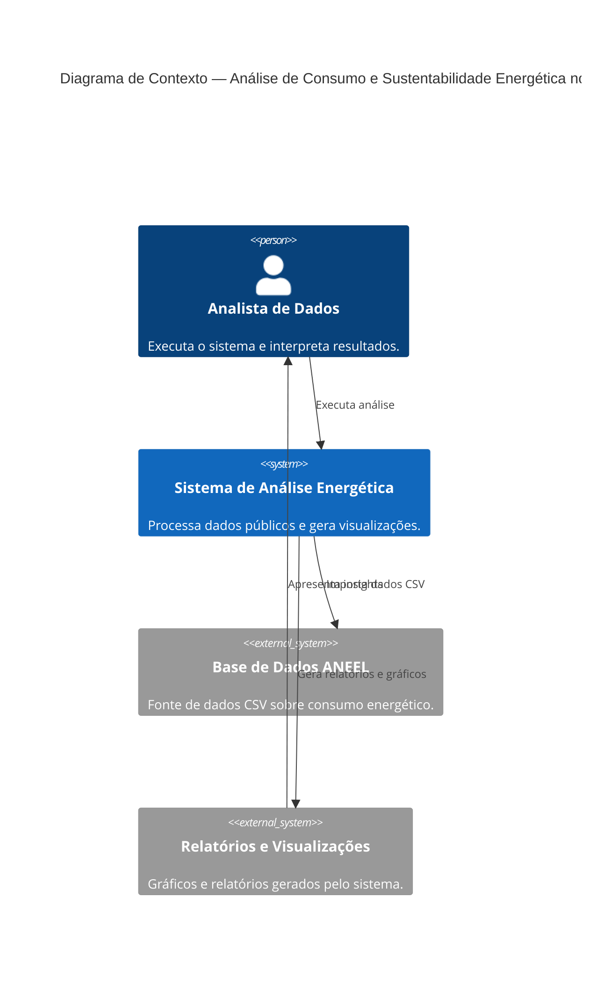

# 📋 Análise de Consumo e Sustentabilidade Energética no Brasil
**Disciplina:** Programação para Ciência de Dados  
**Curso:** MBA Ciência de Dados — UNIFOR  
**Instrutor:** Cássio Pinheiro  

**Integrantes:**  
- Francisco Davi Bandeira Falcão (2528443)  

**Repositório GitHub:** [https://github.com/Bandeiraa/Programacao-para-Ciencia-de-Dados---MBA-Ciencia-de-Dados---Projeto-Final](https://github.com/Bandeiraa/Programacao-para-Ciencia-de-Dados---MBA-Ciencia-de-Dados---Projeto-Final)  
**Data de Entrega:** 14/11/2025  

---

# 🏹 Objetivo do Projeto
Este projeto tem como objetivo analisar o **consumo de energia elétrica no Brasil**, com foco em sustentabilidade e eficiência energética.  
A proposta é identificar **padrões regionais**, **variações de consumo entre setores (residencial, comercial, industrial)** e **indicadores de eficiência energética**, utilizando ferramentas de análise de dados em Python.

**Problema:** compreender como diferentes regiões e tipos de consumidores contribuem para o consumo energético total e como isso se relaciona com o desenvolvimento sustentável.  

**Público-alvo:** estudantes, pesquisadores e gestores interessados em políticas públicas de energia e sustentabilidade.  

---

# 📊 Diagrama de Contexto (Modelo C4)


---

# 🔧 Funcionalidades Implementadas
| **Funcionalidade** | **Descrição** | **Módulos e Conceitos Utilizados** |
|---------------------|---------------|------------------------------------|
| **1. Leitura e Importação de Dados** | Leitura de arquivos CSV fornecidos pela ANEEL, contendo dados de consumo elétrico por tipo de consumidor, região e ano. Inclui verificação de existência do arquivo e tratamento básico de erros. | **Módulo 1:** uso de `open()` e estruturas de dados (`dict`, `list`); tratamento de exceções com `try/except`. <br> **Módulo 2:** uso de `pandas.read_csv()` para importação otimizada. |
| **2. Limpeza e Tratamento de Dados** | Padronização de colunas, remoção de valores ausentes e duplicados, e conversão de tipos de dados (ex: `str` → `float`). | **Módulo 2:** `DataFrame.dropna()`, `drop_duplicates()`, `astype()`; compreensão de listas para limpeza condicional. |
| **3. Análise Descritiva de Consumo** | Cálculo de médias, medianas, desvio padrão e consumo total por região e tipo de consumidor. | **Módulo 1:** criação de funções customizadas com docstrings. <br> **Módulo 2:** operações vetorizadas com `NumPy` (`mean`, `std`, `sum`), agrupamentos com `groupby()`. |
| **4. Agrupamento e Comparação Regional** | Agrupa os dados por região, tipo de consumidor e ano, permitindo análise comparativa e identificação de padrões regionais. | **Módulo 2:** `groupby()`, `agg()`, `pivot_table()`. |
| **5. Correlação entre Variáveis** | Mede o grau de correlação entre consumo energético, PIB per capita e população, identificando relações de sustentabilidade. | **Módulo 2:** `DataFrame.corr()`, operações com `NumPy`. <br> **Módulo 3:** visualização com `seaborn.heatmap()`. |
| **6. Visualizações de Dados** | Geração de gráficos descritivos para comunicar resultados: barras, linhas e heatmaps. Todos os gráficos possuem título, eixos nomeados e legenda. | **Módulo 3:** `Matplotlib` (gráficos de linha e barras), `Seaborn` (heatmaps, boxplots, distribuição). |
| **7. Exportação de Relatórios** | Exporta gráficos e análises em formato `.png` e `.pdf` dentro da pasta `/relatorios/`. | **Módulo 1:** manipulação de arquivos (`open`, `os.path`). <br> **Módulo 3:** salvamento de figuras com `plt.savefig()`. |
| **8. Geração de Insights Finais** | Síntese automática de observações relevantes a partir dos cálculos realizados, indicando padrões de eficiência e consumo elevado. | **Módulo 1:** uso de funções e condicionais (`if/else`). <br> **Módulo 2:** agregações de dados. |

---

# 📦 Estrutura de Dados
## Estruturas de Entrada
Os dados utilizados neste projeto são obtidos a partir dos **datasets públicos da ANEEL**, contendo informações de consumo energético em formato **CSV**.

Cada linha do arquivo representa um registro de consumo, associado a uma região, tipo de consumidor e ano.


**Exemplo de estrutura do arquivo `consumo_energia_brasil.csv`:**

| Região | Tipo_Consumidor | Ano | Consumo_kWh | População | PIB_per_capita |
|--------|------------------|-----|--------------|------------|----------------|
| Norte | Residencial | 2020 | 10432.5 | 18000000 | 23100 |
| Nordeste | Comercial | 2021 | 8421.8 | 53000000 | 19800 |
| Sudeste | Industrial | 2021 | 49320.2 | 88000000 | 46000 |
| Sul | Residencial | 2022 | 12654.3 | 30000000 | 32000 |

📄 **Formato:** `CSV` (valores separados por vírgula)  
📦 **Localização:** pasta `/dados/consumo_energia_brasil.csv`  

---

## Estruturas de Dados Internas
Durante o processamento, os dados serão manipulados em diferentes estruturas:

| Tipo de Estrutura | Utilização | Exemplo |
|--------------------|------------|----------|
| `list` | Armazenar linhas brutas lidas do CSV antes da conversão | `["Norte,Residencial,2020,10432.5,18000000,23100"]` |
| `dict` | Mapear valores por chave (ex: consumo por região) | `{"Norte": 10432.5, "Sul": 12654.3}` |
| `pandas.DataFrame` | Estrutura principal de manipulação e análise dos dados | `df["Consumo_kWh"].mean()` |
| `numpy.ndarray` | Aplicação de operações matemáticas vetorizadas | `np.mean(df["Consumo_kWh"])` |

Essas estruturas permitem uma manipulação eficiente dos dados, simplificando a limpeza, agregação e análise estatística.

---

## Estruturas de Saída
Os resultados do projeto serão gerados em três formatos principais:

| Tipo de Saída | Descrição | Formato / Extensão |
|----------------|------------|--------------------|
| **Relatórios e Insights** | Resumo dos principais resultados e estatísticas | `.txt` / `.pdf` |
| **Gráficos** | Visualizações geradas a partir do Matplotlib e Seaborn (barras, linhas, heatmaps) | `.png` |
| **DataFrame Final** | Conjunto de dados processados e agregados (exportável) | `.csv` |

**Localização dos arquivos gerados:**
```text
relatorios/
├── resultados_analise.txt
├── consumo_regional.png
└── correlacao_consumo_pib.png
```

---

## Fluxo de Dados Resumido


---

# 💻 Requisitos Técnicos
## Versão do Python
```txt
Python 3.11 ou superior
```

---

## Bibliotecas Utilizadas
| Biblioteca | Versão Recomendada | Finalidade Principal |
|-------------|--------------------|----------------------|
| **pandas** | 2.2.2 | Leitura, tratamento e análise de dados tabulares (importação de CSV, limpeza, agrupamento). |
| **numpy** | 1.26.0 | Cálculos matemáticos e estatísticos vetorizados, suporte a operações numéricas eficientes. |
| **matplotlib** | 3.9.0 | Criação de gráficos e visualizações personalizadas (linhas, barras, histogramas). |
| **seaborn** | 0.13.0 | Visualizações estatísticas aprimoradas e gráficos de correlação (heatmaps, boxplots). |
| **os** | (nativa) | Manipulação de diretórios, verificação e criação de pastas. |
| **pathlib** | (nativa) | Gerenciamento de caminhos de arquivos de forma estruturada e multiplataforma. |
| **warnings** | (nativa) | Controle e filtragem de alertas durante a execução do código. |

---

## Como Instalar as Dependências
#### Clonar o Repositório
```bash
git clone https://github.com/Bandeiraa/Programacao-para-Ciencia-de-Dados---MBA-Ciencia-de-Dados---Projeto-Final.git
cd Programacao-para-Ciencia-de-Dados---MBA-Ciencia-de-Dados---Projeto-Final
```
#### Criar um Ambiente Virtual (opcional, mas recomendado)
```bash
python -m venv venv
venv\Scripts\activate
```
#### Instalar as Dependências
```bash
pip install -r requirements.txt
OU caso prefira instalar manualmente:
pip install pandas==2.2.2 numpy==1.26.0 matplotlib==3.9.0 seaborn==0.13.0
```
#### Estrutura do Arquivo requirements.txt
```bash
pandas==2.2.2
numpy==1.26.0
matplotlib==3.9.0
seaborn==0.13.0
```

---

